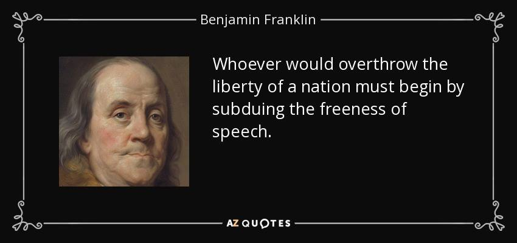

Як завжди після лівацьких постів на захист свободи слова та доступу до інформації, я отримав цілу купу критики. В основному через те, що в позиції не враховані гібридна війна, пацакська агресія та інші обтяжувальні обставини, в яких зараз опинилася наша держава.

<!-- more -->

Справді, нормальний режим функціонування демократії може перериватися на тимчасові військові або надзвичайні стани. В ці періоди діє окрема форма суспільного договору: на цей час народ жертвує певними правами заради якнайшвидшого завершення війни або кризи, ліквідації наслідків стихійного лиха тощо. Деколи держава цим зловживає та встановлює військовий чи надзвичайний стан саме для того, щоб придушити мирні демонстрації народу, який прагне здобуття чи відновлення певних прав.

Важливою особливістю військового та надзвичайного станів є те, що з їхнім завершенням тимчасово обмежені права та свободи автоматично відновлюються. Обмеження ж прав в «нормальному» режимі становить суттєву загрозу, про яку власне й мова. Але ж у нас ситуація інша, дорікають мені, у нас гібридна війна.

Моя думка: війна це явище тимчасове та спрямоване на вирішення ситуації за допомогою силових методів, коли мирні, політичні засоби вже не працюють. У нас не так. У нас – на всю голову відморожений сусід, який використовує силу не для вирішення ситуації, а для її створення. Я не буду зараз робити екскурс в історію пацакстану для тих, хто пропустив останні 18 років. Обмежуся лише тим, що на даному етапі розвитку диктатури в РФ їхньому уряду потрібен зовнішній ворог. Бажано, хтось дуже злий, щоб на фоні цього антагоніста пуйло виглядало більш-менш пристойно. Зараз негативний імідж «Київської хунти» підтримується в свідомостях росіян здебільшого за допомогою інтенсивної пропаганди. Та чим далі стежкою закручування гайок піде український уряд, тим легше Кремлю буде досягати своєї мети. І триватиме це стільки, скільки пуйло при владі, тобто ми не можемо вважати це тимчасовим явищем.

Тому хочемо ми чи ні, розглядати агресора нам треба як щось перманентне. Як Ізраїль розглядає ісламські держави, що його не визнали. Як Штати розглядають терористів та наркокартелі. Як Росія, Іран та КНДР розглядають Штати. І так само, як введення військового стану було б контрпродуктивним для розбудови демократичної держави, загрозливим є введення механізмів обмеження прав та свобод громадян. Адже від того, який шлях ми оберемо, – Західну ліберальну демократію, чи Східний тоталітаризм – залежить, якою буде наша держава в недалекому майбутньому.

Ось ми впритул наблизились до коріння проблеми: чому в ХХІ столітті в парламенті європейської країни лунають заклики до впровадження механізмів обмеження свободи слова та доступу до інформації. Справа в тому, що взагалі тоталітаризм простіше за демократію. Прості відповіді на складні запитання та інші популярні політичні методи приваблюють політиків відсутністю необхідності щось пояснювати. Від давньогрецьких популістів, які згноїли Сократа в тюрмі саме за його прихильність до свободи думок та висловлювань, до сучасних українських – популізм не втратив своєї магічної аури. Як боротися з популізмом? Так само, як і з пропагандою: просвітництвом мас. Але це ж так багато роботи… Тому набагато легше заборонити, врегулювати, дати змогу блокувати, створити ще один реєстр та "вдосконалити" КПК. Тут нічого не треба мудрувати, всі розв'язки на поверхні. Їхня ефективність сумнівна, але ж видно, що "ми щось робимо".

Остання репліка, про свободу слова. Чую як часто дорікають, не завжди в цивілізованій манері, що ліберал-демократи носяться з свободою слова як дурень зі ступою та ставляться до неї як до релігійної догми. Поясню, чому може скластися таке враження.

Як каже Сем Гарріс, якого я б не став підозрювати в догматизмі, свобода слова захищає всі інші. Лише зберігаючи свободу слова ми можемо зберегти можливість продовжувати перемовини суспільства та держави без застосування сили з обох боків – повстань та репресій відповідно. Аргументована, цивілізована дискусія можлива лише в умовах свободи слова. Саме тому збереження свободи слова таке важливе та вимагає такої безкомпромісної рішучості.